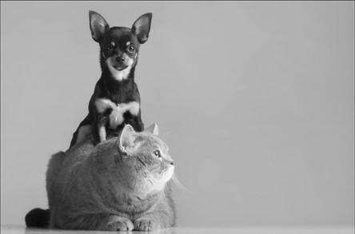
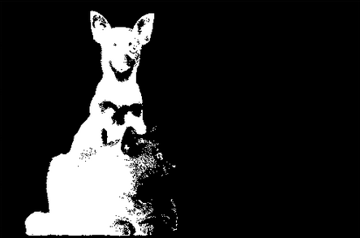

# Introduction To Image Processing

## What is image processing?

To understand image processing, we have to first understand what an Image is.An image is a visual representation of in object or a scenario. It can be in the form of paintings, drawing, photograhs or any form of deception visible to our eyes. Digital Image is a form of image that is stored and processed by computers. Digital image consists of finite number of elements called pixel, each of which has a particular location and value. Image Processing refers to processing images using digital computers. It consists of processes whose inputs and outputs are images and encompasses range of tasks such as extracting features from an image, detecting objects, segmenting regions and so on.

## Image Representation

Digital Images are represented as a grid of pixels,each pixel containing information about its color and intensity. Images can be of three types:
 - Binary Image: Pixel can hold only two values i.e 0 and 1. Binary images can only store two colors: Black and White.
 - Gray Scaled Image: Pixel can hold values betweeon 0 and 255. 8 bits is required to store the values. The color of these images can be described as having shades of gray.
 - Colored Image: Colored images typically have three channels—Red, Green, and Blue (RGB). Each channel holds pixel values between 0 and 255, similar to grayscale images. However, instead of representing different shades of gray, these values indicate the intensity of the respective color.
 
 Lets look at three different images to understand them better.
 
   

## Image Manipulation

Image Manipulation refers to transforming the images using different algorithms and tools. This includes basic adjustments like resizing, cropping and rotating to advanced operations like color conversion and correctness, blurring, blending and morphological transformation. Some of the frequently used image manipulation techniques are listed below:
 - **Color Conversion**: Changing the color of image from one color space to another. For eg: Converting rgb image to gray-scaled or hsl color space.
 - **Affine Transformations**: Applying geometric transformations such as resizing, scaling, cropping, shearing,translating,  rotating and flipping.
 - **Filtering and Enhancent**: This include blurring\(softening the details of image and reducing noise), sharpening \(make image crisper by enhancing edges and fine details), edge detection\{identifying and higlighting edges}, corner detection \(identifying and highlighting corners)
 - **Other Techniques**:  Besides the techniques mentioned above, there are several other image manipulation techniques used for specific purposes, that includes Morphological Transformations like Erosion, Dilation, Opening and Closing , Blending \( Combining two or more images) , Inpainting and Deconvolution, etc. 
 
## Image Filtering

Image Filtering is a technique in Image Processing which involves changing the pixel values of an image so that the colors of the image are altered without changing the pixel positions. These methods include applying different mathematical operations or filters to an image to accomplish particular goals including noise reduction , picture sharpening, blurring, edge detection, and feature extraction. 

