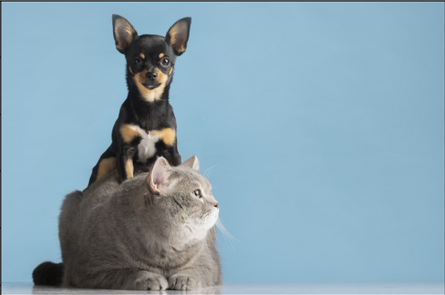

# Introduction To Image Processing

## What is image processing?

To understand image processing, we have to first understand what an Image is.An image is a visual representation of in object or a scenario. It can be in the form of paintings, drawing, photograhs or any form of deception visible to our eyes. Digital Image is a form of image that is stored and processed by computers. Digital image consists of finite number of elements called pixel, each of which has a particular location and value. Image Processing refers to processing images using digital computers. It consists of processes whose inputs and outputs are images and encompasses range of tasks such as extracting features from an image, detecting objects, segmenting regions and so on.

## Image Representation

Digital Images are represented as a grid of pixels,each pixel containing information about its color and intensity. Images can be of three types:
 - Binary Image: Pixel can hold only two values i.e 0 and 1. Binary images can only store two colors: Black and White.
 - Gray Scaled Image: Pixel can hold values betweeon 0 and 255. 8 bits is required to store the values. The color of these images can be described as having shades of gray.
 - Colored Image: Colored images typically have three channels—Red, Green, and Blue (RGB). Each channel holds pixel values between 0 and 255, similar to grayscale images. However, instead of representing different shades of gray, these values indicate the intensity of the respective color.
 
 Lets look at three different images to understand them better.
 
   

## Image Manipulation

Image Manipulation refers to transforming the images using different algorithms and tools. This includes basic adjustments like resizing, cropping and rotating to advanced operations like color conversion and correctness, blurring, blending and morphological transformation. Some of the frequently used image manipulation techniques are listed below:
 - **Color Conversion**: Changing the color of image from one color space to another. For eg: Converting rgb image to gray-scaled or hsl color space.
 - **Affine Transformations**: Applying geometric transformations such as resizing, scaling, cropping, shearing,translating,  rotating and flipping.
 - **Filtering and Enhancent**: This include blurring\(softening the details of image and reducing noise), sharpening \(make image crisper by enhancing edges and fine details), edge detection\{identifying and higlighting edges}, corner detection \(identifying and highlighting corners)
 - **Other Techniques**:  Besides the techniques mentioned above, there are several other image manipulation techniques used for specific purposes, that includes Morphological Transformations like Erosion, Dilation, Opening and Closing , Blending \( Combining two or more images) , Inpainting and Deconvolution, etc. 
 
## Image Filtering

Image Filtering is a technique in Image Processing which involves changing the pixel values of an image so that the colors of the image are altered without changing the pixel positions. These methods include applying different mathematical operations or filters to an image to accomplish particular goals including noise reduction , picture sharpening, blurring, edge detection, and feature extraction. Image filtering involves using a filter or kernel for every pixel on the image so new pixel values can be obtained. Some of the widely used filters are discussed below:
- **Mean Filter**: It is a linear filter which work by sliding through the image pixel by pixel, replacing each value with the avergage grey level values of all the neighbouring pixel values including itself. Mean filter is widely used for smoothing, noise reduction and sharpening.
- **Gaussian Filter**: Gaussian Filter is an important filter which is specially effective for noise reduction. When a gaussian filter is applied to an image, it gives more weight to the central pixel than the surrounding pixels. However, it is important to remove any outliers or spikes through preprocessing before applying this filter to the image. 
- **Sobel Filter**: Sobel Filter is mainly used for edge detection and is key to various edge detecting algorithms. Sobel Filter uses two kernels, Horizontal and Vertical Kernel, and entails two convolutions with these two kernels. The results from these convolutions highlight the intensity gradients in the image, revealing edges by calculating the magnitude of the gradient at each pixel. This filter is widely used due to its simplicity and effectiveness in detecting edges in images.

## Histograms

Histogram is a graph or a plot, which gives you an overall idea about the intensity distribution of an image. It is a plot with pixel values (ranging from 0 to 255) in X-axis and corresponding number of pixels in the image on Y-axis. By looking at the historgram of an image, you get  intuition about contrast, brightness, intensity distribution of that image. Lets see an example of histogram in use to better understand the concept

The left side of the image is a text consisting of few lines while the right side is a corresponding histogram of pixel intensities value calculated in row axis. The values are higher in the region where there are character(pixel in white color) wheres in the region where there is no visible text, the pixel intensity values are low. This is well captured in the histogram. Further, using the histogram the we can seperates each lines of the text

## Resources
- [Gonzalez, Digital Image Processing, 4e](https://dl.icdst.org/pdfs/files4/01c56e081202b62bd7d3b4f8545775fb.pdf)
- [Image Filtering Techniques in Image Processing — Part 1](https://medium.com/@henriquevedoveli/image-filtering-techniques-in-image-processing-part-1-d03362fc73b7)
- [Segmentation in OCR](https://towardsdatascience.com/segmentation-in-ocr-10de176cf373)
- [Histograms - 1 : Find, Plot, Analyze](https://docs.opencv.org/4.10.0/d1/db7/tutorial_py_histogram_begins.html)

## Next Steps

We will discuss algorithms and related code in the [notebooks](../notebooks) folder.

