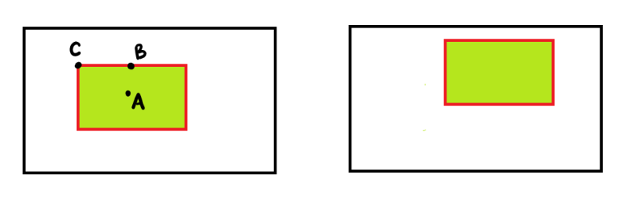

# Feature Detection and Matching

When a person looks at a photo of a cat, they might recognize features like the cat's eyes, ears, and whiskers. Humans can easily identify these features because they have learned to associate them with the concept of a cat through experience and visual learning. For example, a human can spot a cat's pointy ears or distinctive eye shape even in different poses or lighting conditions.

## Feature

A feature is a distinctive attribute or element in an image that helps in identifying or describing the content. Features can be points, lines, edges, textures, or shapes that provide valuable information about the image structure.

Now, let's take the example of image matching. Suppose you are given two images and your task is to match the rectangle present in images. And let's assume that we have 3 feature points: A-flat area, B-edge, and C-corner. So, Now we are trying to understand which of these 3 feature points is a better feature for matching the rectangle.

As A is a flat area, it's difficult to find the exact location of this point in the other image. Thus it is not good feature for image matching. For B(edge), we can find approximate location but not the accurate location. So, an edge is a better feature than A but still not the best one. But we can easily and accurately locate C (corner) in the other image and is thus is considered a good feature. So, corners are considered to be good features in an image. These feature points are also known as interest points.

### Good Feature or Interest Point
A good feature or interest point is one that is robust to changes in illumination or brightness, scale and can be reliably computed with a high degree of repeatability. And also gives us enough knowledge about the task (see corner feature points for matching above). Also, a good feature should be unique, distinctive, and global.

To detect interest points (corners), specialized algorithms are used, highlighting the most distinctive and reliable points in an image:

1. **Harris corner detector**: This algorithm identifies corners in an image by analyzing the local image structure using the second-moment matrix (structure tensor), which captures changes in intensity around each pixel. The algorithm computes a corner response function that highlights points where intensity gradients change significantly in multiple directions, indicating the presence of corners, which are useful for tracking and matching tasks.

2. **Scale-Invariant Feature Transform (SIFT)**: This algorithm detects and describes local features in an image by identifying keypoints using Difference of Gaussian (DoG) filters across multiple scales, ensuring that the features are invariant to scale, rotation, and affine transformations. SIFT then assigns orientations to these keypoints based on local image gradients, making them robust against changes in viewpoint and illumination.

3. **Oriented FAST and Rotated BRIEF (ORB)**: This algorithm is a fast, efficient alternative to SIFT for real-time applications, combining the FAST corner detection method, which quickly identifies potential keypoints, with the BRIEF descriptor, which uses binary strings to represent features. ORB enhances BRIEF by adding orientation information to the descriptors, making the algorithm robust to rotational changes and suitable for applications requiring rapid feature extraction and matching.

Features are typically classified into two main categories:

### 1. Edge Features

**Definition**: Edge features represent boundaries or transitions between different regions in an image. They indicate significant changes in intensity or color, which often correspond to object boundaries or structural changes.

**Characteristics**:
- **High Gradient Magnitude**: Edges are characterized by a large change in pixel values.
- **Locational Information**: They provide information about the shape and structure of objects.
- **Directional**: Edges can have orientations, which can be used to define the direction of boundaries.

**Detection Methods**:
- **Canny Edge Detector**: Identifies edges by finding local maxima in the gradient of the image intensity.
- **Sobel Operator**: Detects edges by computing the gradient of image intensity at each pixel.
- **Prewitt Operator**: Similar to the Sobel operator but uses different convolution kernels.

**Applications**:
- Object detection
- Image segmentation
- Scene understanding

### 2. Keypoint Features

**Definition**: Keypoint features are specific points of interest in an image that are distinctive and stable across different views, scales, and rotations. They often correspond to corners, blobs, or other notable points in an image.

**Characteristics**:
- **Distinctive**: Keypoints are chosen for their unique and identifiable characteristics.
- **Invariant**: They are designed to be invariant to changes in scale, rotation, and sometimes illumination.
- **Descriptive**: Keypoints are often accompanied by descriptors that describe the local image patch around the keypoint.

**Detection Methods**:
- **SIFT (Scale-Invariant Feature Transform)**: Detects keypoints and computes descriptors that are invariant to scale and rotation.
- **SURF (Speeded-Up Robust Features)**: Similar to SIFT but faster, with slightly different characteristics.
- **ORB (Oriented FAST and Rotated BRIEF)**: Combines FAST keypoint detection with BRIEF descriptors, suitable for real-time applications.

**Applications**:
- Object recognition
- Image matching and stitching
- 3D reconstruction

## Local Feature Descriptors

Once we’ve found interesting points in an image, we need a way to describe what they look like, just like a detective would describe a suspect's facial features. Local feature descriptors capture the visual characteristics around these points, allowing us to compare and match them across different images.

Imagine each descriptor as a unique "superhero badge" that each interesting point in an image gets, making it easy to spot and identify even in different images!

#### Some popular local feature descriptors include:

1. **SIFT Descriptors**: Think of SIFT like a superhero who can see in all directions. SIFT not only finds interesting points (like landmarks) but also gives each one a unique "badge" that describes what the area around it looks like. These badges are like little histograms that show the direction of colors and shapes in that area, making them easy to spot even if they are zoomed in, rotated, or in a different light. 

2. **ORB Descriptors**: Imagine ORB as a superhero duo combining two powers—speed and strength. The ORB method uses the FAST corner detector to quickly find important points and the BRIEF descriptor to create a simple, unique code for each point, like a binary "secret code" made up of 0s and 1s. While BRIEF alone doesn’t work well when the image is rotated, ORB adds a special power to see the direction, ensuring the descriptors still match, even if the image is turned around.

3. **Speeded-Up Robust Features (SURF)**: SURF is like a superhero with turbo speed! It’s designed to work fast while still being strong and reliable. Instead of spending a lot of time to carefully measure everything (like SIFT), SURF uses "box filters" to quickly guess where the interesting points are, and then it uses "Haar wavelets" to describe what those points look like. This makes SURF quicker and better for real-time tasks, like finding a friend in a fast-moving crowd.

4. **Binary Robust Invariant Scalable Keypoints (BRISK)**: BRISK is another fast superhero, designed to work well in a team with other heroes. It uses a mix of speed and smart detection to find the best points in an image. BRISK detects keypoints by looking for the most noticeable ones, just like spotting the brightest stars in the night sky, and then uses a binary descriptor to create a unique "binary badge" for each point. This makes BRISK fast, efficient, and perfect for finding and matching features without using too much memory.

## Feature Matching and Correspondence

After we’ve found and described the features in different images, the next step is to match these features together, like connecting the dots between two maps. Feature matching algorithms help us find the best matches between sets of feature descriptors, allowing us to connect similar points across images. This is useful for things like creating a panorama from multiple photos, recognizing objects, or even building 3D models.

#### Popular feature matching techniques include:

1. **Brute-Force Matching**: Imagine you have a big bag of puzzle pieces, and you want to find the matching piece for each one. Brute-force matching is like checking each puzzle piece against every other piece one by one to find the best match. It uses measurements like the distance between points (like how close the colors or shapes are) to decide if two pieces match. This method guarantees the best matches because it checks everything, but it takes a lot of time and effort—just like finding every single match in a giant puzzle!

2. **K-Dimensional (k-D) Tree**: A k-D tree is like a special detective tool that helps you find matching pieces faster. Instead of comparing each puzzle piece with all the others, it organizes the pieces in a smart, tree-like structure. This way, when you need to find a match, you only look at a small group of possible pieces instead of the whole bag, saving a lot of time. It’s like having a helper who says, "The matching piece is probably in this smaller pile," so you don’t have to search everywhere.

3. **FLANN (Fast Library for Approximate Nearest Neighbors)**: FLANN is like a super-fast sorting machine that helps you find matches quickly, but it sometimes makes small mistakes to save time. It uses clever algorithms, like building a tree of puzzle pieces or organizing them by how similar they are. This allows FLANN to match features much faster than checking each one individually. It’s like finding the right piece in a puzzle, but you’re okay if it’s almost perfect because you want to finish quickly.

By using these methods, we can efficiently and accurately match features between images, making it easier to perform tasks like blending photos together or recognizing objects no matter the angle.

## Resources
- [The AI Learner](https://theailearner.com/2021/09/24/feature-detection-description-and-matching/)
- [Computer Vision — Lesson 3: Traditional Feature Detection and Extraction Methods](https://medium.com/@nerdjock/computer-vision-lesson-3-traditional-feature-detection-and-extraction-methods-f74ddeed4ed6)

## Next Steps

We will discuss algorithms and related code in the [notebooks](../notebooks) folder.

