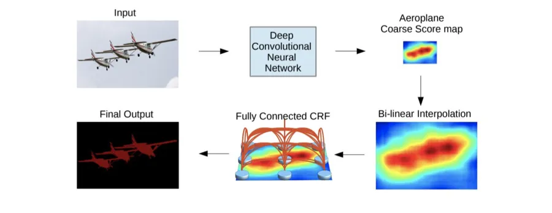

# Image Segmentation

Image segmentation is an important task in computer vision that involves partitioning an image into multiple segments or regions to simplify its representation and make it more meaningful and easier to analyze. This process separates objects, boundaries, or structures within the image, which helps in understanding the content of the image. Image segmentation has numerous applications such as image compression, scene understanding, medical imaging, object detection, and satellite imagery analysis.

![Image Segmentation results of DeepLabV3 [12] on sample images. Photo Credit: https://arxiv.org/pdf/2001.05566.pdf](../../images/Image_segmentation_result_DeepLabV3.png)

## Applications of Image Segmentation

- **Image Compression**: By segmenting an image into regions with similar colors or textures, it becomes easier to compress the image efficiently, reducing the amount of data required to represent the image.
- **Scene Understanding**: In autonomous driving and robotics, segmenting an image helps understand the environment by identifying objects such as pedestrians, vehicles, traffic signs, and road boundaries.
- **Medical Imaging**: Segmentation is crucial in medical imaging to identify and analyze anatomical structures, tumors, or other abnormalities in medical scans like MRI, CT, and X-ray images.
- **Satellite Image Analysis**: Segmentation of satellite images helps in identifying various features such as water bodies, urban areas, forests, and roads, which is essential for urban planning, agriculture, and environmental monitoring.

## Types of Image Segmentation

Image segmentation techniques can be broadly classified into the following categories:

1. **Thresholding**: This is one of the simplest methods, which involves separating pixels into different classes based on intensity values. A global or local threshold is applied to classify pixels above or below certain intensity levels. It is particularly useful for images with distinct foreground and background.

2. **Edge-Based Segmentation**: This method detects edges within an image to identify boundaries of objects. Techniques like Canny edge detection and Sobel filters are commonly used. The idea is to find places in an image where there is a sudden change in intensity, which indicates an edge.

3. **Region-Based Segmentation**: This technique involves partitioning an image into regions that are similar according to a set of predefined criteria. Region growing and region splitting and merging are common approaches where regions are merged based on similarities in color, intensity, or texture.

4. **Clustering-Based Segmentation**: Methods like k-means clustering and Gaussian Mixture Models (GMMs) are used to group pixels into clusters based on their feature space. This type of segmentation is widely used for images with multiple objects or regions with similar characteristics.

5. **Graph-Based Segmentation**: This method represents the image as a graph, where each pixel is a node connected to its neighbors. Segmentation is achieved by finding the minimum cut in the graph that separates different objects or regions. Algorithms like Normalized Cuts and Minimum Spanning Tree are examples of graph-based segmentation techniques.

6. **Deep Learning-Based Segmentation**: Recent advancements in deep learning have led to the development of powerful segmentation models such as Fully Convolutional Networks (FCNs), U-Net, Mask R-CNN, and DeepLab. These models leverage convolutional neural networks (CNNs) to learn hierarchical features from large datasets, providing state-of-the-art performance on various segmentation tasks.

## Deep Learning Approaches for Image Segmentation

Deep learning has revolutionized image segmentation with methods that automatically learn features and patterns from data. Some popular deep learning models for image segmentation include:

- **Fully Convolutional Networks (FCNs)**: These networks replace the fully connected layers in traditional CNNs with convolutional layers, allowing them to make pixel-level predictions for segmentation tasks. FCNs can take any image size as input and produce a segmentation map of the same size. They use "skip connections," which help combine high-level features from the later layers with low-level details from the earlier layers. This approach allows the model to produce more accurate and detailed segmentations by merging the broader, more abstract information with finer details. FCNs have shown excellent performance on various datasets, including PASCAL VOC, NYUDv2, and SIFT Flow, achieving state-of-the-art results in image segmentation.

- **Convulational Models with Graphical Models**: Research has shown that deep Convolutional Neural Networks (CNNs) often have poor localization properties, meaning their responses in the final layers are not well-suited for accurate object segmentation. To address the poor localization of object boundaries by CNNs in semantic segmentation, researchers have combined CNNs with graphical models like Conditional Random Fields (CRFs) and Markov Random Fields (MRFs).

 - CNN + CRF Models: Models like those proposed by Chen et al. combine CNNs with fully connected CRFs to refine segmentation results by improving boundary localization. The CRF helps by considering pixel-level correlations and enforcing smoothness across object boundaries, resulting in more accurate segmentation.

 - Deep Structured Networks: Schwing and Urtasun’s approach trains CNNs and CRFs jointly, achieving better results on datasets like PASCAL VOC 2012. Lin et al. introduced contextual deep CRFs to use image context effectively for improved segmentation.

 - MRF-Based Models: Liu et al. developed the Parsing Network, which incorporates rich contextual information into MRFs for enhanced segmentation. This network allows for efficient, end-to-end computation and captures both local and global dependencies.

These models combine deep learning with graphical methods to enhance the accuracy and precision of image segmentation.

## Resources
- [Image Segmentation Using Deep Learning: A Survey](https://medium.com/swlh/image-segmentation-using-deep-learning-a-survey-e37e0f0a1489)
