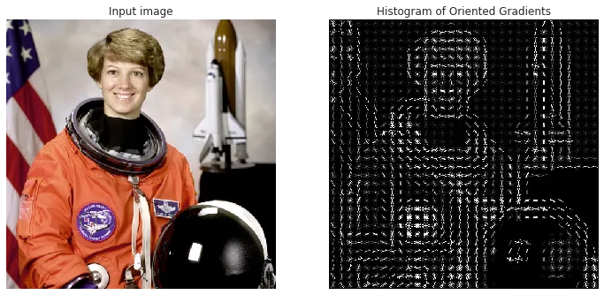

# 2.3 Object Detection

Deep Learning is not able to solve all computer vision (CV) problems. There are some scenarios where traditional techniques with global features provide a better solution due to their simplicity, efficiency, and lower computational requirements.

## Traditional Techniques
Traditional object detection methods rely on a set of well-established techniques that predate the widespread adoption of deep learning. Here’s a brief overview of these techniques:

### 1. **Feature-Based Object Detection**

   - **Haar Cascades**
     - **Concept and Historical Significance**: Haar cascades are one of the earliest methods for real-time object detection, particularly known for their use in face detection. Developed by Paul Viola and Michael Jones, this technique gained popularity due to its simplicity and effectiveness.
     - **How Haar Cascades Work**:
       - **Integral Images**: An efficient way to compute the sum of pixel intensities within a rectangular region, allowing for rapid feature computation.
       - **Adaboost Algorithm**: A machine learning algorithm used to select the most relevant features and create a strong classifier by combining several weak classifiers.
     - **Applications and Limitations**:
       - **Applications**: Mainly used for detecting faces, eyes, and other simple objects in real-time applications.
       - **Limitations**: Haar cascades are sensitive to lighting conditions, pose variations, and have high false-positive rates. They also require extensive manual tuning to achieve reasonable accuracy.

   - **Histograms of Oriented Gradients (HOG)**
     - **Feature Extraction using HOG**: HOG captures edge or gradient structure that is characteristic of local shapes within an image. It divides the image into small connected regions (cells) and computes a histogram of gradient directions or edge orientations for the pixels within each cell.

      
     
      

     - **Training a Detector (Linear SVM)**: A linear Support Vector Machine (SVM) is trained using HOG features to classify regions of the image as object or background.
     - **Pros and Cons of HOG for Object Detection**:
       - **Pros**: Effective for pedestrian detection and other applications where object shapes are distinct and consistent.
       - **Cons**: Less effective in complex environments with variable lighting and occlusions. It also requires significant computational resources for extracting features and training classifiers.

### 2. **Template Matching**

   - **Basic Concept and Use Cases**: Template matching involves sliding a template image over the input image (using convolution) and measuring the similarity between the template and the image regions. It is simple and easy to implement.
   - **Correlation Coefficient Matching**: This technique measures the degree of similarity between the template and image patches using a correlation coefficient, which is a statistical measure of how closely the template matches a region of the image.
   - **Limitations of Template Matching**:
     - **Scale and Rotation Sensitivity**: Template matching does not handle scale and rotation variations well. Templates must be resized or rotated to match objects at different scales and orientations.
     - **High Computational Cost**: Sliding the template across the entire image at different scales and rotations is computationally expensive.

### 3. **Sliding Window Approach**

   - **Concept and Implementation**: This technique involves moving a fixed-size window across the image at different scales and running a classifier on each window to detect objects. It is a brute-force method for object detection.
   - **Challenges with the Sliding Window Technique**:
     - **Computational Efficiency**: The sliding window approach is computationally intensive because it requires running the classifier on numerous windows across multiple scales.
     - **Window Size and Aspect Ratio**: Choosing the correct window size and aspect ratio is challenging, especially for detecting objects of varying sizes and shapes.

### 4. **Region-Based Detection Methods**

   - **Selective Search**
     - **Overview of the Algorithm**: Selective Search is a region proposal algorithm that combines the strengths of both exhaustive search and segmentation. It hierarchically groups similar regions based on color, texture, size, and shape compatibility.
     - **Combining Region Proposals with Classifiers**: The proposed regions are then classified using a pre-trained classifier, such as a support vector machine (SVM), to determine the presence of objects.
     - **Strengths and Weaknesses of Selective Search**:
       - **Strengths**: Efficiently generates a small number of region proposals with high object localization accuracy, reducing computational load.
       - **Weaknesses**: Computationally expensive compared to simpler techniques and may not generalize well to all object categories.

### 5. **Evaluation Metrics for Object Detection**

   - **Precision, Recall, and F1-Score**: These metrics are used to evaluate the performance of object detection models by considering both true positives and false positives:
     - **Precision**: The ratio of true positive detections to the total number of detections (true positives and false positives).
     - **Recall**: The ratio of true positive detections to the total number of actual object instances.
     - **F1-Score**: The harmonic mean of precision and recall, providing a balanced measure of accuracy.

   - **Intersection over Union (IoU)**: A metric that measures the overlap between the predicted bounding box and the ground truth bounding box. IoU is used to determine whether a predicted bounding box sufficiently overlaps with the ground truth to be considered a correct detection.

   - **Mean Average Precision (mAP)**: A comprehensive metric that averages the precision across all recall levels for multiple object classes. It provides an overall measure of the model’s performance across different object categories and detection thresholds.

### Advantages of Traditional Computer Vision Techniques

- **Improving Performance with Traditional Feature-Based Approaches**: 
  - Traditional computer vision techniques, such as the following, have proven effective in various computer vision tasks:
    - **Scale Invariant Feature Transform (SIFT)** 
    - **Speeded Up Robust Features (SURF)** 
    - **Features from Accelerated Segment Test (FAST)** 
    - **Hough Transforms** 
    - **Geometric Hashing** 

- **Combination with Machine Learning Algorithms**:
  - Feature descriptors like SIFT and SURF are often paired with traditional machine learning algorithms (e.g., Support Vector Machines, K-Nearest Neighbors) to address various computer vision problems.

- **Efficiency and Simplicity Over Deep Learning**:
  - Traditional computer vision methods can often solve problems more efficiently and with fewer lines of code than deep learning (DL) approaches.
  - Algorithms such as SIFT, color thresholding, and pixel counting are not class-specific. They perform consistently across different images, unlike deep learning models that may be overfitted to a specific dataset.
  - Tasks like image stitching and 3D mesh reconstruction benefit from traditional techniques as they do not require specific class knowledge. While these tasks can be performed using deep learning, they often require extensive datasets and significant research efforts, which may not be practical for all applications.

- **Choosing the Right Approach**:
  - It's essential to use common sense when choosing between traditional and deep learning methods for a given application. For instance, classifying products on a conveyor belt by color (red vs. blue) can be achieved using simple color thresholding rather than a deep neural network, which would require a large dataset for training.

- **Limitations of Deep Learning**:
  - Deep learning models can struggle to generalize beyond the training data if the dataset is limited, leading to overfitting.
  - Due to the complexity and number of parameters in deep neural networks, it can be challenging to manually adjust them for better performance across a wider range of images. Deep learning models are often criticized as "black boxes" due to this lack of transparency.
  - In contrast, traditional computer vision methods offer full transparency, allowing engineers to adjust parameters and gain insights into their algorithms, making it easier to generalize to new images.

- **Applications in Low-Cost and Specific Scenarios**:
  - Traditional techniques are still valuable in situations where the problem can be simplified, allowing them to be deployed on low-cost microcontrollers.
  - They are also used to enhance deep learning techniques by highlighting specific features in the data, augmenting datasets, or assisting in dataset annotation.

- **Broader Use Cases for Traditional Techniques**:
  - Traditional computer vision techniques are advantageous for many complex tasks that are difficult to implement with deep learning due to their non-differentiable nature. These tasks include:
- Robotics 
    - Augmented Reality 
    - Automatic Panorama Stitching 
    - Virtual Reality 
    - 3D Modelling 
    - Motion Estimation 
    - Video Stabilization 
    - Motion Capture 
    - Video Processing 
    - Scene Understanding 

## Challenges of Traditional Computer Vision Methods

### 1. Feature Engineering Limitations
- **Manual Feature Design**: Traditional methods often rely on manually designed features (e.g., edge detectors, descriptors) which may not generalize well across different applications. Designing effective features requires domain expertise and can be time-consuming.
- **Adaptability**: Traditional techniques may struggle to adapt to new or unforeseen scenarios because they rely on predefined features rather than learning from data.

### 2. Scalability and Flexibility
- **Scaling to Large Datasets**: Traditional algorithms may not scale efficiently to large datasets or high-dimensional data compared to DL methods which are designed to handle such scenarios more robustly.
- **Flexibility**: Traditional methods might lack flexibility in handling diverse types of input data (e.g., varying lighting conditions, occlusions) without significant re-engineering.

### 3. Real-Time Processing
- **Computational Overhead**: Some traditional methods can be computationally intensive, particularly when applied to high-resolution images or in real-time applications. This can limit their applicability in time-sensitive scenarios.

### 4. Robustness to Noise and Variations
- **Sensitivity to Noise**: Traditional methods can be sensitive to noise and variations in image conditions. This sensitivity can lead to poor performance in less controlled environments.
- **Generalization**: These methods might not generalize well to different contexts or unseen variations without significant adjustments or additional processing.

### 5. Integration with Modern Technologies
- **Compatibility**: Traditional techniques may not integrate seamlessly with modern technologies and frameworks that are optimized for DL. This can hinder their adoption in contemporary AI applications.
- **Development Ecosystem**: The development ecosystem around traditional CV methods may be less vibrant compared to the fast-evolving DL community, potentially limiting access to cutting-edge tools and support.

### 6. Complexity in Handling 3D Data
- **3D Reconstruction**: Traditional CV methods can be limited in handling 3D data and complex 3D scene understanding compared to advanced DL methods, which are increasingly adept at such tasks.

### 7. Handling Dynamic Environments
- **Adaptation to Changes**: Traditional approaches might struggle to adapt to dynamic changes in the environment or scene without significant reconfiguration or retraining.

### 8. Interdisciplinary Knowledge Requirements
- **Domain-Specific Expertise**: Effective use of traditional methods often requires specialized knowledge in computer vision and signal processing, which can be a barrier for broader adoption.

Traditional computer vision methods are still valuable in many contexts, particularly where data or computational resources are limited. However, they face challenges where deep learning and hybrid approaches often offer significant advantages.

## Modern Techniques (Non-Deep Learning Based)

1. **Introduction to Modern Object Detection Techniques**
   - Evolution of Object Detection from Traditional to Modern Approaches
   - Motivation for More Sophisticated Methods

2. **Advanced Feature-Based Methods**
   - **Deformable Part Models (DPM)**
     - Overview and Advantages Over Rigid Models
     - Training DPMs and Real-World Applications
   - **Viola-Jones Algorithm**
     - Improvements Over Haar Cascades
     - Speed vs. Accuracy Trade-offs

3. **Motion-Based Detection Techniques**
   - Background Subtraction and Optical Flow
   - Advantages and Challenges in Dynamic Environments

4. **3D Object Detection Methods**
   - Overview of Stereo Vision and Point Cloud-Based Approaches
   - Applications in Robotics and Autonomous Vehicles

5. **Multispectral Object Detection**
   - Using Infrared, Thermal, and Hyperspectral Data
   - Fusion Techniques for Multispectral Data

6. **Model-Based Object Detection**
   - 3D Model Matching and Pose Estimation
- Industrial and Medical Applications

7. **Combination of Methods**
   - Hybrid Approaches Using Feature-Based and Region-Based Techniques
   - Pros and Cons of Hybrid Methods

### Resources 
- [Deep Learning vs. Traditional Computer Vision](https://arxiv.org/pdf/1910.13796)
- [A Gentle Introduction Into The Histogram Of Oriented Gradients](https://medium.com/analytics-vidhya/a-gentle-introduction-into-the-histogram-of-oriented-gradients-fdee9ed8f2aa)

