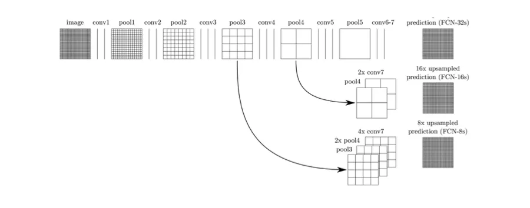

# Image Segmentation with Deep Learning

Deep learning has revolutionized image segmentation with methods that automatically learn features and patterns from data. Some popular deep learning models for image segmentation include:

- **Fully Convolutional Networks (FCNs)**: These networks replace the fully connected layers in traditional CNNs with convolutional layers, allowing them to make pixel-level predictions for segmentation tasks. FCNs can take any image size as input and produce a segmentation map of the same size. They use "skip connections," which help combine high-level features from the later layers with low-level details from the earlier layers. This approach allows the model to produce more accurate and detailed segmentations by merging the broader, more abstract information with finer details. FCNs have shown excellent performance on various datasets, including PASCAL VOC, NYUDv2, and SIFT Flow, achieving state-of-the-art results in image segmentation.

  
*A fully convolutional image segmentation network. Photo Credit : https://arxiv.org/pdf/2001.05566.pdf*

  
*Skip connections combining coarse, high-level information with fine, low-level information. Photo Credit : https://arxiv.org/pdf/2001.05566.pdf*

- **Convulational Models with Graphical Models**: Research has shown that deep Convolutional Neural Networks (CNNs) often have poor localization properties, meaning their responses in the final layers are not well-suited for accurate object segmentation. To address the poor localization of object boundaries by CNNs in semantic segmentation, researchers have combined CNNs with graphical models like Conditional Random Fields (CRFs) and Markov Random Fields (MRFs).

 - CNN + CRF Models: Models like those proposed by Chen et al. combine CNNs with fully connected CRFs to refine segmentation results by improving boundary localization. The CRF helps by considering pixel-level correlations and enforcing smoothness across object boundaries, resulting in more accurate segmentation.

 - Deep Structured Networks: Schwing and Urtasun’s approach trains CNNs and CRFs jointly, achieving better results on datasets like PASCAL VOC 2012. Lin et al. introduced contextual deep CRFs to use image context effectively for improved segmentation.

 - MRF-Based Models: Liu et al. developed the Parsing Network, which incorporates rich contextual information into MRFs for enhanced segmentation. This network allows for efficient, end-to-end computation and captures both local and global dependencies.

*CNN + CRF model. Photo Credit : https://arxiv.org/pdf/2001.05566.pdf*

These models combine deep learning with graphical methods to enhance the accuracy and precision of image segmentation.

## Resources
- [Image Segmentation Using Deep Learning: A Survey](https://medium.com/swlh/image-segmentation-using-deep-learning-a-survey-e37e0f0a1489)
- [Image Segmentation: Architecture, Losses, Datasets, and Frameworks](https://neptune.ai/blog/image-segmentation)
